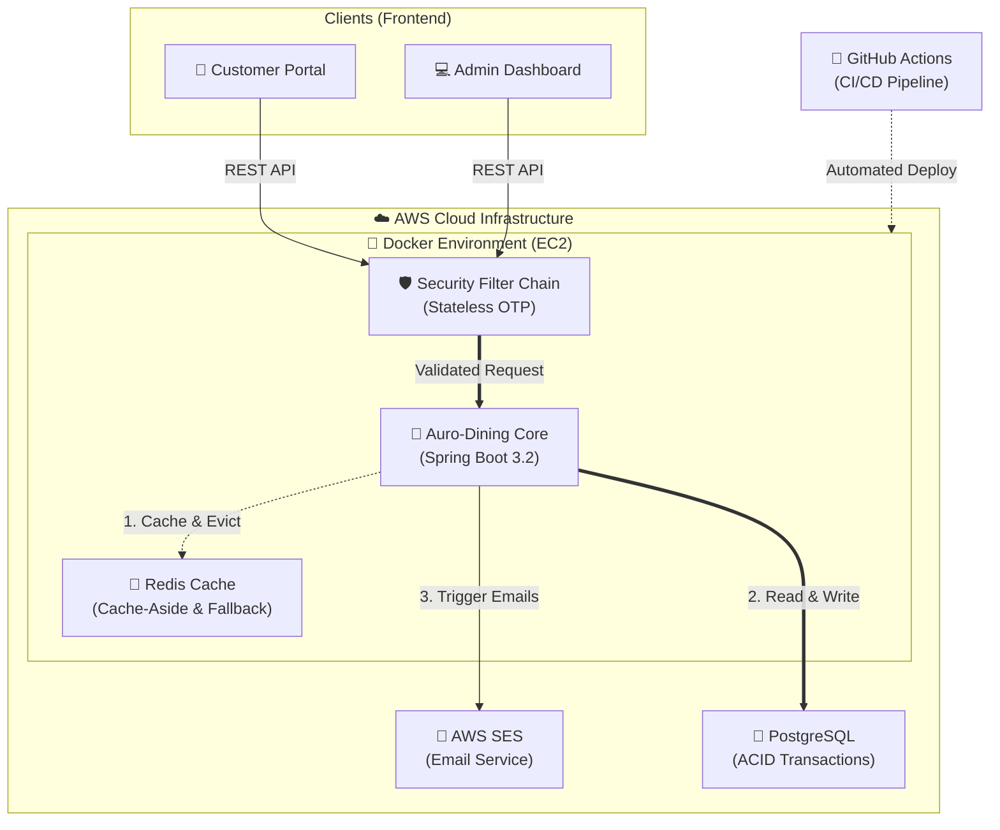
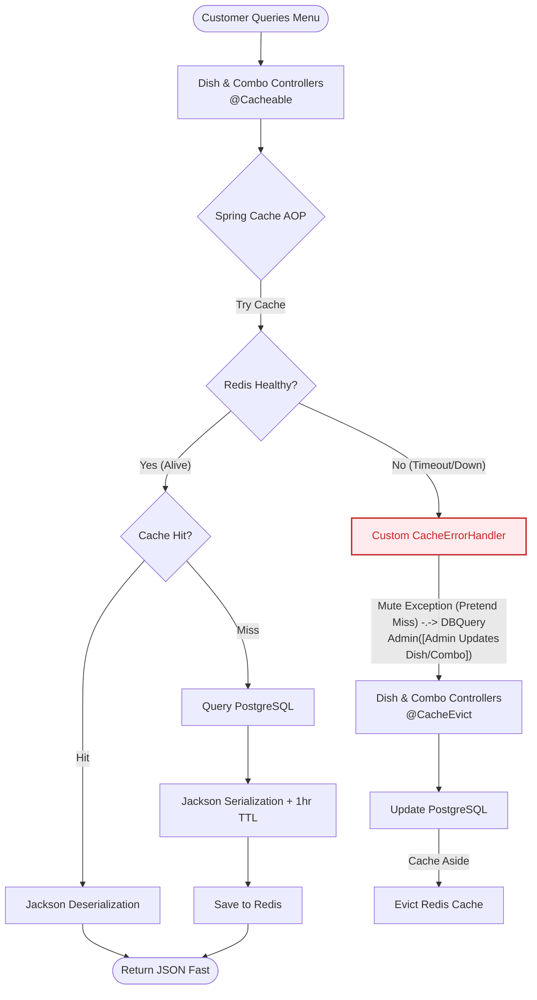
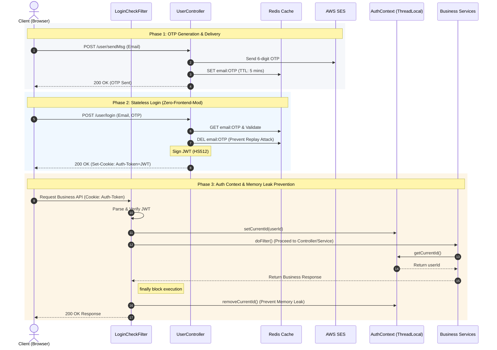

# 馃嵔锔?Auro-Dining Restaurant Management System


A modern cloud native Restaurant Ordering and Management System. This project provides a complete solution for both restaurant administrators and dining customers, featuring high-concurrency caching, stateless security, and a fully automated cloud-native CI/CD pipeline.

---

## 馃洜锔?Tech Stack & Architecture

*   **Backend Framework**: Java 17, Spring Boot 3.2, Spring Data JPA
*   **Database & Caching**: PostgreSQL, Redis (Configured with custom Jackson serialization and cache penetration defense)
*   **Security**: Stateless Filter chains + `ThreadLocal` context isolation
*   **Cloud & DevOps**: AWS EC2, AWS SES, Docker, Docker-Compose, GitHub Actions
*   **Performance Metrics**: JMeter load testing demonstrated an API latency drop from 500ms to <10ms and a 15x throughput increase (up to 3000 QPS) after cache optimization.

---

## 鉁?Core Features

### 馃懁 Customer Portal
*   **Dynamic Email Authentication**: Secure login via AWS SES dynamic verification codes.
*   **High-Performance Menu Browsing**: Millisecond-level menu and category loading powered by Redis caching.
*   **Smart Shopping Cart**: Real-time cart state management with complex pricing aggregations.
*   **Order Management**: Seamless order placement and historical order tracking.

### 馃懆鈥嶐煃?Admin Dashboard
*   **Employee Management**: Role-based access control and staff onboarding.
*   **Product Lifecycle**: Comprehensive management of dishes, flavors (SKUs), and nested combo meals (Setmeals).
*   **Automated Auditing**: All administrative actions are automatically tracked (Who & When) using Spring Data JPA Auditing.
*   **Order Processing**: Real-time order state machine (Pending -> Preparing -> Delivering -> Completed).

---

## 馃彈锔?System Architecture



### 馃攷 Under the Hood: High-Availability Cache Workflow
To handle peak dining hours and ensure system resilience, the caching layer implements the **Cache-Aside Pattern** with a custom **Graceful Degradation (Fallback)** mechanism.



---


### 馃攼 Under the Hood: Stateless Auth & Memory Safety
To support distributed deployments and strict memory management, the authentication flow uses a **Zero-Frontend-Modification JWT strategy** combined with isolated `ThreadLocal` context management.



---

## 馃殌 Quick Start (Local Development)

### Prerequisites
*   [Java 17+](https://adoptium.net/)
*   [Docker Desktop](https://www.docker.com/products/docker-desktop/) (for easy Redis setup)
*   Maven 3.8+

### 1. Start External Services (Database & Cache)
If you have Docker installed, you can quickly spin up the required Redis instance:
```bash
docker-compose -f deploy/docker-compose.yml up redis -d
```
*(Ensure PostgreSQL is running locally on port 5432 with a 'restaurant' database)*

### 2. Configure AWS Secrets (Optional)
For email verification to work, configure your AWS SES credentials in `application.yml` or your environment variables. 
*(Note: If AWS is not configured, the app will gracefully fallback to logging the verification codes in the console).*

### 3. Build & Run
```bash
mvn clean install -DskipTests
mvn spring-boot:run
```
The API will be available at `http://localhost:80`.

---

## 鈽侊笍 Cloud Deployment (CI/CD)

This project features a fully automated **CI/CD Pipeline** leveraging GitHub Actions and AWS infrastructure:
1. Push code to the `main` branch.
2. GitHub Actions automatically compiles the Java 17 artifact and builds the Docker image.
3. The image is deployed to an **AWS EC2** instance running as a purely stateless compute node.
4. Data persistence is offloaded to **Amazon RDS (PostgreSQL)**, completely decoupling storage from compute for enterprise-grade durability.
5. Spring Boot Actuator performs automated HTTP health checks (`/actuator/health`) to verify container readiness during deployment.

---
*Developed with 鉂わ笍 and modern Java engineering practices.*

